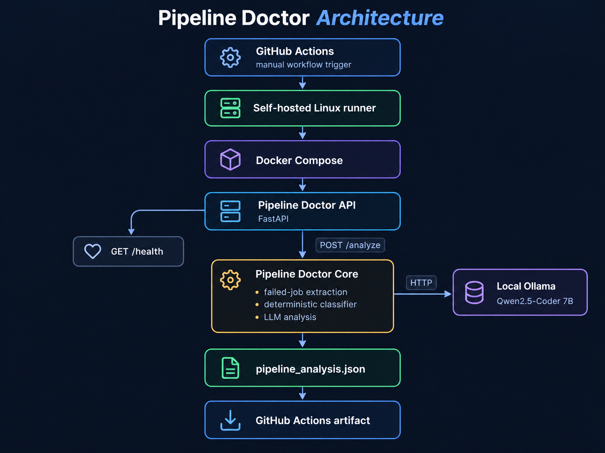
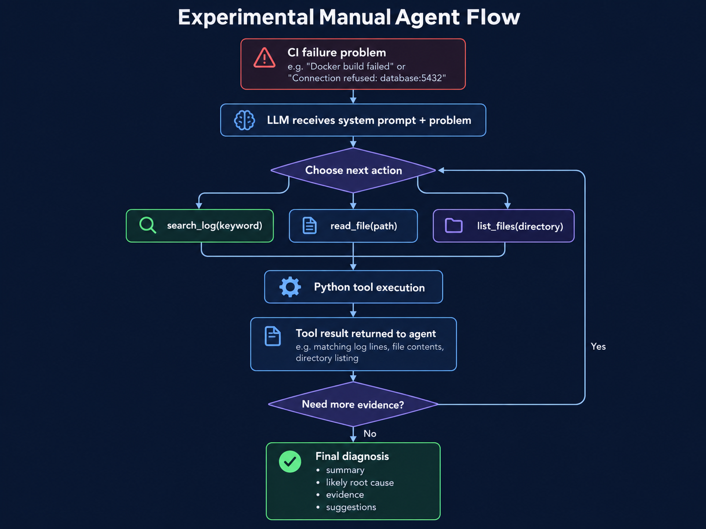

# Pipeline Doctor

**AI-assisted CI failure investigation that turns failed pipeline evidence into a structured troubleshooting report.**

Pipeline Doctor is a Python-based CI reliability prototype designed to reduce the manual effort required to investigate failed CI pipelines.

The application receives pipeline failure data, identifies failed jobs, classifies known failure patterns, analyzes the available evidence, and produces a structured troubleshooting report containing likely causes and practical next steps.

> **Current status:** Pipeline Doctor works locally and through a self-hosted GitHub Actions workflow. It is not currently a public production service.

---

## Why I Built It

CI failures can come from many different sources, including:

- missing files during container builds
- unavailable dependent services
- configuration problems
- permission failures
- failing automated tests
- infrastructure or network problems

Engineers often begin troubleshooting by manually searching logs, checking configuration files, and trying to identify which evidence is relevant.

Pipeline Doctor explores how part of this investigation can be automated while keeping the result evidence-based and understandable to an engineer.

The goal is not to replace engineering judgement.

The goal is to reduce the initial effort required to answer:

```text
What failed?
Why might it have failed?
What evidence supports that conclusion?
What should I check next?
```

---

## What the Current Prototype Does

The current working prototype can:

- receive a CI pipeline event through a FastAPI service
- identify failed pipeline jobs
- classify known failure patterns using deterministic Python rules
- use a local Ollama/Qwen model to generate structured troubleshooting guidance
- run inside Docker and Docker Compose
- execute through a self-hosted GitHub Actions workflow
- generate a JSON analysis report and upload it as a CI artifact

Pipeline Doctor currently recognizes example failure categories such as:

```text
docker_build
connection
permission
test_failure
unknown
```

---

## Example Result

A failed CI job such as:

```text
Docker build failed
COPY failed: requirements.txt not found
```

can produce an investigation result such as:

```text
Failure category:
docker_build

Summary:
Docker could not access requirements.txt during the image build.

Likely cause:
The file may not be available in the Docker build context
or the COPY path may be incorrect.

Suggested checks:
- verify the Docker build context
- inspect the Dockerfile COPY path
- confirm the required file is available during the build
```

The generated result is also stored as structured JSON for use by CI workflows and other automation.

---

## Architecture



The current architecture connects GitHub Actions, a self-hosted runner, Docker Compose, the FastAPI service, deterministic failure classification, local Ollama analysis, and the generated CI artifact.

---

## Experimental Manual Agent



The repository also contains a separate experimental troubleshooting agent under:

```text
manual_agent/
```

The agent was built manually in Python to understand how tool-based agent loops work before introducing an agent framework.

It currently has three read-only tools:

```text
search_log(keyword)
read_file(path)
list_files(directory)
```

The agent can:

- receive a CI failure problem
- choose which investigation tool to use
- execute the tool through Python
- receive the tool result as evidence
- decide whether more investigation is needed
- produce a structured final diagnosis

The manual agent also includes:

- bounded execution using `max_steps`
- duplicate tool-call detection
- project-root path restrictions
- conversation history
- evidence-based reasoning rules

> The manual agent is currently separate from the main FastAPI Pipeline Doctor flow and is not yet fully integrated.

---

## GitHub Actions Workflow

The workflow runs Pipeline Doctor on a self-hosted Linux runner.

The current flow is:

```text
Checkout repository
        |
        v
Configure container user
        |
        v
Create output directory
        |
        v
Build and start services
with Docker Compose
        |
        v
Wait for /health
        |
        v
POST pipeline_event.json
to /analyze
        |
        v
Generate analysis report
        |
        v
Upload report as artifact
        |
        v
Stop services
```

### Trigger

The workflow currently uses a manual trigger:

```yaml
on:
  workflow_dispatch:
```

This means pushing code does not automatically execute Pipeline Doctor. The workflow is started manually from GitHub Actions.

---

## Pipeline Event

The current prototype uses synthetic pipeline data.

Example:

```json
{
  "pipeline_id": 4812,
  "repository": "payment-service",
  "status": "failed",
  "jobs": [
    {
      "name": "unit-tests",
      "status": "passed",
      "log": "48 tests passed"
    },
    {
      "name": "docker-build",
      "status": "failed",
      "log": "COPY failed: requirements.txt not found"
    },
    {
      "name": "integration-tests",
      "status": "failed",
      "log": "Connection refused: database:5432"
    }
  ]
}
```

Pipeline Doctor extracts the failed jobs and analyzes them individually.

---

## Example Structured Analysis

```json
{
  "name": "docker-build",
  "log": "COPY failed: requirements.txt not found",
  "category": "docker_build",
  "analysis_status": "success",
  "analysis": {
    "summary": "The Docker build could not find requirements.txt.",
    "likely_root_cause": "The file may be outside the Docker build context or the COPY path may be incorrect.",
    "suggestions": [
      "Verify that requirements.txt is available in the Docker build context.",
      "Inspect the Dockerfile COPY instruction.",
      "Verify the directory used when executing docker build."
    ]
  }
}
```

---

## Run Locally

### Prerequisites

The current setup requires:

```text
Python
Docker
Docker Compose
Ollama
qwen2.5-coder:7b
```

Check that Ollama is running:

```bash
ollama list
```

Start Pipeline Doctor:

```bash
docker compose up --build
```

Check the FastAPI health endpoint:

```bash
curl http://localhost:8080/health
```

Expected response:

```json
{
  "status": "healthy"
}
```

Send the sample pipeline event:

```bash
curl --fail   -X POST   http://localhost:8080/analyze   -H "Content-Type: application/json"   --data @pipeline_event.json
```

The analysis report is written to the configured output location.

---

## Repository Structure

```text
testpilot/
├── .github/
│   └── workflows/
│       └── pipeline-doctor.yaml
│
├── docs/
│   ├── architecture.md
│   ├── workflow.md
│   └── images/
│       ├── pipeline-doctor-architecture.png
│       └── manual-agent-flow.png
│
├── examples/
│   └── pipeline_event.json
│
├── manual_agent/
│   ├── agent.py
│   ├── prompts.py
│   ├── sample_log.txt
│   └── tools.py
│
├── api.py
├── pipeline_doctor.py
├── pipeline_event.json
├── Dockerfile
├── compose.yaml
├── requirements.txt
└── README.md
```

---

## Technologies Used

- **Python** — CI failure processing and automation
- **FastAPI** — REST API
- **Requests** — HTTP communication
- **Ollama** — local LLM runtime
- **Qwen2.5-Coder 7B** — structured troubleshooting guidance
- **Docker** — application container
- **Docker Compose** — local orchestration
- **GitHub Actions** — CI workflow
- **Self-hosted GitHub Actions Runner** — local workflow execution
- **JSON** — pipeline input and structured output
- **Manual Python Agent Loop** — experimental evidence-gathering workflow

---

## Current Limitations

Pipeline Doctor is a working prototype rather than a production-ready system.

Current limitations include:

- pipeline input is still synthetic
- GitHub Actions evidence is not yet collected directly
- the manual agent is not yet integrated into the main API flow
- API authentication is not implemented
- secret redaction is not yet complete
- LLM output validation is limited
- retry handling is limited
- large-log handling is not yet implemented
- analysis output is currently JSON-focused
- deployment currently depends on a self-hosted runner and local Ollama

---

## Next Improvements

The next steps are intentionally incremental:

- add reliable unit and API tests
- add Pydantic request and response models
- improve structured logging
- add secret redaction
- add safer LLM error handling
- integrate real GitHub Actions failure evidence
- integrate the manual agent into the main Pipeline Doctor flow
- generate a visual HTML report
- add a short README demo GIF
- deploy a production-style version after the prototype is stable

---

## Engineering Principles

- evidence before speculation
- deterministic checks before LLM reasoning where appropriate
- read-only investigation tools by default
- bounded agent execution
- synthetic project data only
- no employer-confidential code or logs
- automated testing before infrastructure expansion
- small incremental changes
- AI assists engineers rather than replacing engineering judgement

---

## Portfolio Goal

Pipeline Doctor is designed to demonstrate practical engineering across:

- test automation
- CI/CD reliability
- Python backend development
- API testing
- failure investigation
- containerisation
- agentic AI fundamentals
- cloud-native engineering

The emphasis is not on adding technologies for their own sake.

Each feature should solve a clear reliability, testing, or troubleshooting problem and produce a result that can be demonstrated and verified.
