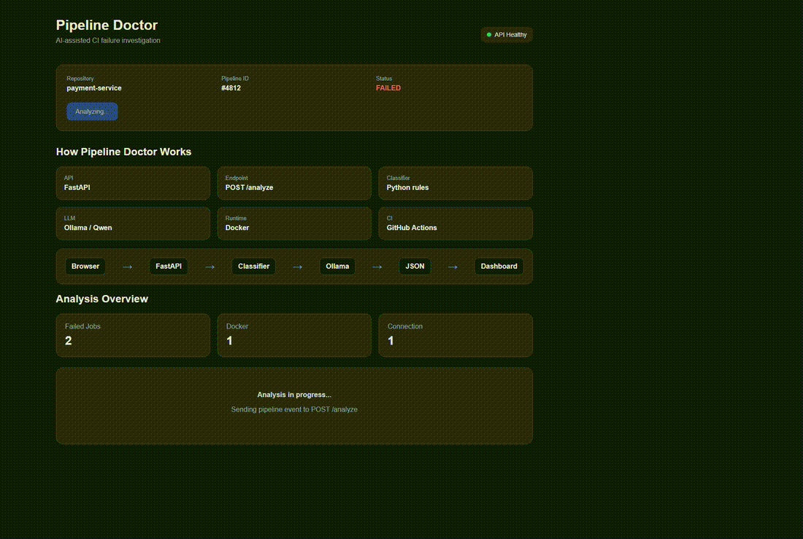

# Pipeline Doctor

**AI-assisted CI failure investigation that turns failed pipeline evidence into a structured troubleshooting report.**

Pipeline Doctor is a portfolio project built with Python, FastAPI, Docker, GitHub Actions, JavaScript, and a local Ollama LLM.

It accepts a pipeline event, extracts failed jobs, classifies known failure patterns, asks an LLM for structured troubleshooting guidance, and returns the result through a REST API.

A browser dashboard consumes the API and renders the analysis dynamically.

---

## Demo

Pipeline Doctor includes a browser-based dashboard for investigating CI failures.

The demo shows:

- failed pipeline information
- FastAPI `POST /analyze`
- rule-based failure classification
- Ollama / Qwen analysis
- structured troubleshooting results
- HTTP response status
- analysis duration
- raw JSON API response



[Watch higher-quality MP4](docs/demo/pipeline-doctor-demo.mp4)

---

## Architecture

```text
Browser Dashboard
      |
      | POST /analyze
      v
FastAPI :8080
      |
      v
Pipeline Doctor Core
      |
      +----> Failed-job extraction
      |
      +----> Rule-based classifier
      |
      +----> Ollama / Qwen
      |
      v
Structured JSON response
      |
      v
Browser renders analysis
```

## GitHub Actions Workflow

The workflow runs Pipeline Doctor on a self-hosted Linux runner.

The current execution flow is:

```text
Checkout repository
        |
        v
Start pipeline event HTTP server
        |
        v
Verify pipeline_event.json
        |
        v
Build and run Pipeline Doctor container
        |
        v
Analyze failed jobs
        |
        v
Generate pipeline_analysis.json
        |
        v
Upload analysis report as artifact
```

### Trigger

The workflow currently uses a manual trigger:

```yaml
on:
  workflow_dispatch:
```

This means pushing code does not automatically execute Pipeline Doctor. The workflow is started manually from GitHub Actions.

## Pipeline Event

For the current prototype, Pipeline Doctor uses a sample pipeline event.

Example:

```json
{
  "pipeline_id": 4812,
  "repository": "payment-service",
  "status": "failed",
  "jobs": [
    {
      "name": "unit-tests",
      "status": "passed",
      "log": "48 tests passed"
    },
    {
      "name": "docker-build",
      "status": "failed",
      "log": "COPY failed: requirements.txt not found"
    },
    {
      "name": "integration-tests",
      "status": "failed",
      "log": "Connection refused: database:5432"
    }
  ]
}
```

Pipeline Doctor extracts only the failed jobs and sends their failure information for analysis.

## Example Analysis

A failed Docker build can produce an analysis such as:

```json
{
  "name": "docker-build",
  "log": "COPY failed: requirements.txt not found",
  "category": "docker_build",
  "analysis_status": "success",
  "analysis": {
    "summary": "The Docker build could not find requirements.txt.",
    "likely_root_cause": "The file is missing from the build context or the COPY path is incorrect.",
    "suggestions": [
      "Verify that requirements.txt exists.",
      "Check the Dockerfile COPY path.",
      "Inspect the Docker build context."
    ]
  }
}
```

## Run Locally

### 1. Start the sample pipeline event server

From the project directory:

```bash
python3 -m http.server 8000
```

The sample pipeline event is then available on port `8000`.

### 2. Make sure Ollama is running

Pipeline Doctor currently uses:

```text
qwen2.5-coder:7b
```

through the local Ollama API on port `11434`.

### 3. Run Pipeline Doctor with Docker Compose

```bash
docker compose run --rm --build pipeline-doctor
```

Docker Compose configures the container so it can communicate with the pipeline event server and Ollama running on the host machine.

### 4. Check the generated report

```bash
python3 -m json.tool output/pipeline_analysis.json
```

The report contains the failed jobs and their generated analysis.

## Current Prototype Scope

The current implementation focuses on demonstrating the complete CI failure-analysis flow:

```text
Pipeline event
      ↓
Failed-job extraction
      ↓
Failure classification
      ↓
LLM analysis
      ↓
Structured JSON report
      ↓
GitHub Actions artifact
```

## Technologies Used

- **Python** — pipeline event processing, failed-job extraction, failure classification, and LLM integration
- **Requests** — communication with the pipeline event server and Ollama API
- **Ollama** — local LLM runtime
- **Qwen2.5-Coder 7B** — analyzes CI failure logs and generates troubleshooting suggestions
- **Docker** — packages Pipeline Doctor into a reproducible container
- **Docker Compose** — configures and runs the container locally
- **GitHub Actions** — executes the analysis workflow
- **Self-hosted GitHub Actions Runner** — runs the workflow with access to local Docker and Ollama
- **JSON** — pipeline event input and structured analysis output
- **Python HTTP Server** — temporarily serves the sample pipeline event during the prototype stage

## Current Limitations

Pipeline Doctor is currently a working prototype rather than a production-ready system.

Current limitations include:

- The pipeline event is currently a static sample rather than being generated from a real CI failure.
- The pipeline event is served using Python's temporary HTTP file server.
- Ollama and the LLM run locally.
- There is currently no API authentication or authorization.
- CI logs are not scanned or redacted for secrets before LLM analysis.
- LLM output validation is limited.
- There is no retry strategy for failed API or LLM requests.
- Large CI logs are not currently truncated or split into smaller sections.
- The generated analysis report is currently JSON only.
- The workflow currently uses a self-hosted runner and requires the local supporting services to be available.

## Planned Improvements

Future improvements include:

- Replace the temporary Python HTTP server with FastAPI.
- Accept pipeline events through an API or webhook.
- Collect real failure information from GitHub Actions, Jenkins, or GitLab pipelines.
- Add schema validation for pipeline events and LLM responses.
- Redact secrets and sensitive information before sending logs to the LLM.
- Add retry and improved timeout handling for external requests.
- Add support for large logs through truncation or relevant-log extraction.
- Generate human-readable Markdown investigation reports in addition to JSON.
- Add automated unit and integration tests.
- Improve error handling and observability.
